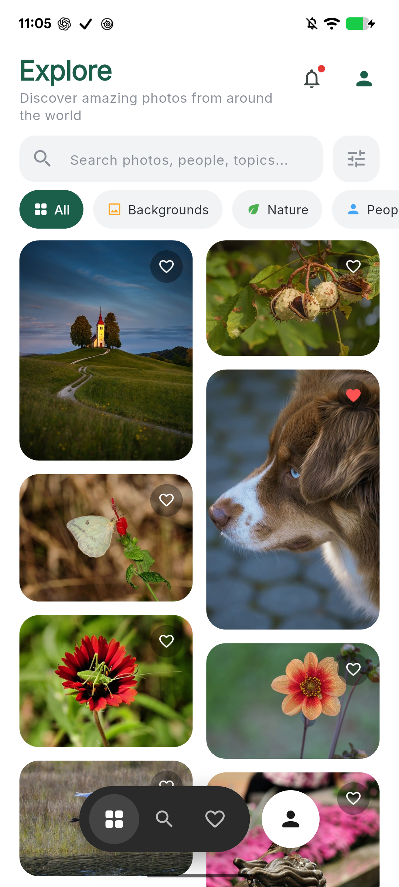
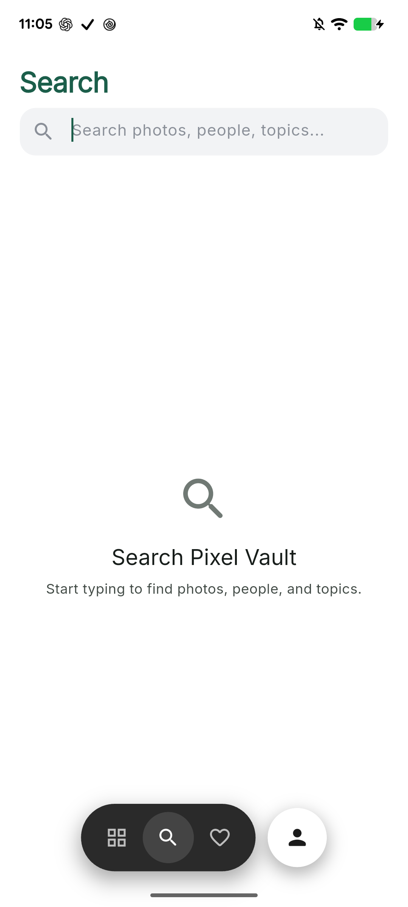
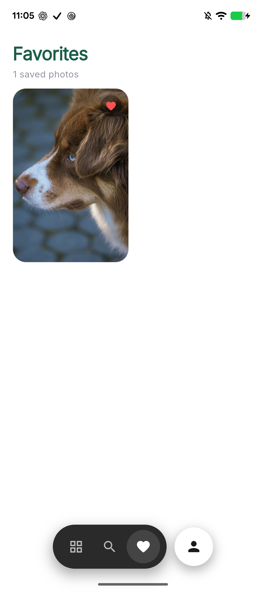
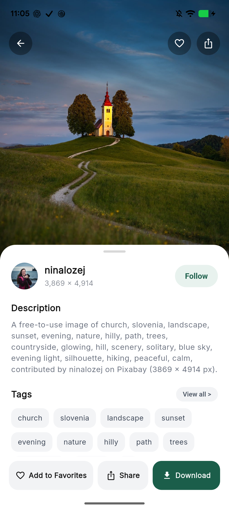
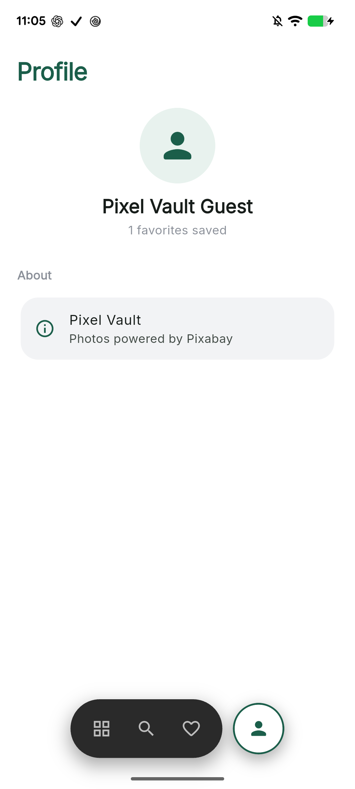
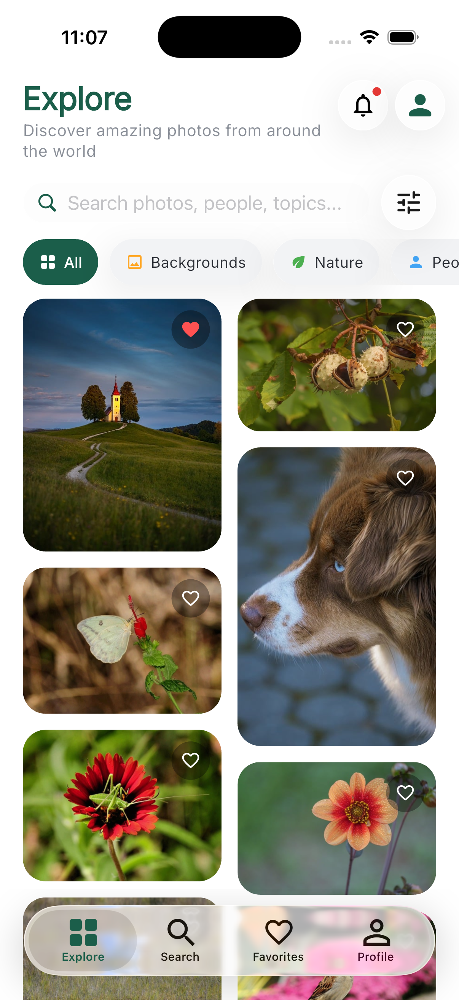
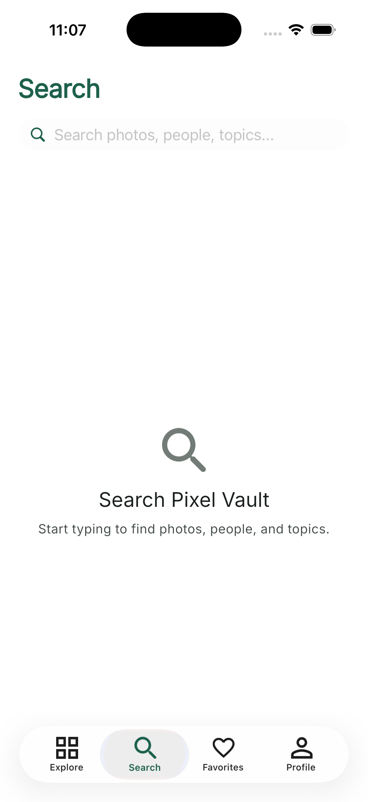

# Pixel Vault

A production-style Flutter image gallery that consumes the [Pixabay API](https://pixabay.com/api/docs/), supports infinite scrolling, image detail, downloads, and local favorites.

## Screenshots

### Android (Pixel 6)

<p align="center">
  
  
  
</p>
<p align="center">
  
  
</p>

| Explore | Search | Favorites | Detail | Profile |
|:-------:|:------:|:---------:|:------:|:-------:|
| Masonry grid + category chips | Empty state until you type | Saved photos | Sheet with tags & download | Guest + about |

### iOS (iPhone 17 Simulator)

<p align="center">
  
  
</p>

Liquid Glass tab bar, Explore masonry gallery, and Search empty state.

## Features

### Core
- **Responsive masonry grid** — 2–5 columns based on screen width
- **Infinite scroll / pagination** — loads more near the bottom of the list
- **Loading states** — shimmer placeholders on first load; spinner for next pages
- **Error handling** — friendly messages with retry for network / API failures
- **Image detail** — full-size image, photographer, tags, stats, and description
- **Description** — Pixabay does not provide editorial captions; a readable description is derived from tags + photographer (documented here)
- **Download** — saves the large image to the device photo library (with progress)
- **Favorites** — persisted locally with Hive; dedicated Favorites tab

### Bonus
- Search
- Pull-to-refresh
- Category filters
- Masonry grid (`flutter_staggered_grid_view`)
- Hero animations between grid and detail
- Light theme
- Share sheet
- Download progress indicator
- Animated splash screen
- Unit + widget tests

## Architecture

```
lib/
  main.dart
  src/
    core/           # API config, exceptions, themes
    data/
      models/       # PixabayImage, ImagePage
      repositories/ # remote ImageRepository (Dio)
      local/        # FavoritesRepository (Hive)
    services/       # DownloadService (gal + share_plus)
    presentation/
      providers/    # Riverpod controllers
      screens/      # Gallery, Detail, Favorites, HomeShell, Splash
      widgets/      # grid, tiles, shimmer, chips, error views
```

**State management:** [Riverpod](https://riverpod.dev/) (`StateNotifier` for gallery and favorites).

**Separation of concerns:** UI → providers → repositories/services → Dio / Hive / Gal.

## API choice

**Pixabay** is used as the image source.

- Docs: https://pixabay.com/api/docs/
- Free API key required (create a free Pixabay account)
- Key is injected at build time via `--dart-define` (never committed)
- Safe search enabled; `per_page` = 30; Pixabay caps accessible results at 500

## Setup

```bash
# 1. Install dependencies
flutter pub get

# 2. Get a free Pixabay API key
#    https://pixabay.com/api/docs/

# 3. Configure your API key
cp .env.example .env
# Edit .env and set PIXABAY_API_KEY=your_key

# 4. Run
flutter run
```

`.env` is gitignored. Do not commit real keys.

### Platform permissions

| Platform | Permission | Purpose |
|----------|------------|---------|
| Android | `INTERNET` | Fetch images |
| Android | `WRITE_EXTERNAL_STORAGE` (≤ API 29) | Save to gallery |
| iOS | `NSPhotoLibraryAddUsageDescription` | Save to Photos |

## Tests

```bash
flutter test
```

Coverage includes:
- Model parsing & description derivation
- Dio → `AppException` mapping
- Gallery pagination / search / error state
- Favorites Hive persistence
- Error / empty widgets
- Home shell navigation (with mocked repository)

## UX notes

- First paint uses a shimmer masonry placeholder
- Pull down on the gallery to refresh
- Heart icon on a tile (or in detail) toggles favorites
- On Android Explore, press back twice within 2s to exit

## License note

Images are provided by Pixabay contributors under the [Pixabay Content License](https://pixabay.com/service/license-summary/). Attribute photographers when required by your use case; this app surfaces photographer names and page URLs for that purpose.
